# Execution Plan — EntreVista AI

## Detailed Analysis Summary

### Change Impact Assessment
- **User-facing changes**: Yes — Telegram bot for candidates, web dashboard for recruiters
- **Structural changes**: Yes — New greenfield system with 5 modules in a modular monolith
- **Data model changes**: Yes — MongoDB collections for campaigns, candidates, conversations, evaluations, audit logs + vector DB for embeddings
- **API changes**: Yes — Next.js API routes for dashboard, Telegram webhook endpoint, OpenAI integration
- **NFR impact**: Yes — Multi-tenancy, 24/7 availability, <10s bot latency, observability stack

### Risk Assessment
- **Risk Level**: Medium
- **Rollback Complexity**: Easy (greenfield — no existing system to break)
- **Testing Complexity**: Complex (AI agent behavior testing, multi-tenant isolation, Telegram integration)

---

## Workflow Visualization

```mermaid
flowchart TD
    Start(["User Request"])

    subgraph INCEPTION["INCEPTION PHASE"]
        WD["Workspace Detection<br/><b>COMPLETED</b>"]
        RA["Requirements Analysis<br/><b>COMPLETED</b>"]
        US["User Stories<br/><b>COMPLETED</b>"]
        WP["Workflow Planning<br/><b>COMPLETED</b>"]
        AD["Application Design<br/><b>EXECUTE</b>"]
        UG["Units Generation<br/><b>EXECUTE</b>"]
    end

    subgraph CONSTRUCTION["CONSTRUCTION PHASE"]
        FD["Functional Design<br/><b>EXECUTE</b>"]
        NFRA["NFR Requirements<br/><b>EXECUTE</b>"]
        NFRD["NFR Design<br/><b>EXECUTE</b>"]
        ID["Infrastructure Design<br/><b>EXECUTE</b>"]
        CG["Code Generation<br/><b>EXECUTE</b>"]
        BT["Build and Test<br/><b>EXECUTE</b>"]
    end

    Start --> WD
    WD --> RA
    RA --> US
    US --> WP
    WP --> AD
    AD --> UG
    UG --> FD
    FD --> NFRA
    NFRA --> NFRD
    NFRD --> ID
    ID --> CG
    CG --> BT
    BT --> End(["Complete"])

    style WD fill:#4CAF50,stroke:#1B5E20,stroke-width:3px,color:#fff
    style RA fill:#4CAF50,stroke:#1B5E20,stroke-width:3px,color:#fff
    style US fill:#4CAF50,stroke:#1B5E20,stroke-width:3px,color:#fff
    style WP fill:#4CAF50,stroke:#1B5E20,stroke-width:3px,color:#fff
    style AD fill:#FFA726,stroke:#E65100,stroke-width:3px,stroke-dasharray: 5 5,color:#000
    style UG fill:#FFA726,stroke:#E65100,stroke-width:3px,stroke-dasharray: 5 5,color:#000
    style FD fill:#FFA726,stroke:#E65100,stroke-width:3px,stroke-dasharray: 5 5,color:#000
    style NFRA fill:#FFA726,stroke:#E65100,stroke-width:3px,stroke-dasharray: 5 5,color:#000
    style NFRD fill:#FFA726,stroke:#E65100,stroke-width:3px,stroke-dasharray: 5 5,color:#000
    style ID fill:#FFA726,stroke:#E65100,stroke-width:3px,stroke-dasharray: 5 5,color:#000
    style CG fill:#4CAF50,stroke:#1B5E20,stroke-width:3px,color:#fff
    style BT fill:#4CAF50,stroke:#1B5E20,stroke-width:3px,color:#fff
    style INCEPTION fill:#BBDEFB,stroke:#1565C0,stroke-width:3px,color:#000
    style CONSTRUCTION fill:#C8E6C9,stroke:#2E7D32,stroke-width:3px,color:#000
    style Start fill:#CE93D8,stroke:#6A1B9A,stroke-width:3px,color:#000
    style End fill:#CE93D8,stroke:#6A1B9A,stroke-width:3px,color:#000

    linkStyle default stroke:#333,stroke-width:2px
```



### Text Alternative
```
Phase 1: INCEPTION
  - Workspace Detection (COMPLETED)
  - Requirements Analysis (COMPLETED)
  - User Stories (COMPLETED)
  - Workflow Planning (COMPLETED)
  - Application Design (EXECUTE)
  - Units Generation (EXECUTE)

Phase 2: CONSTRUCTION (per-unit loop)
  - Functional Design (EXECUTE)
  - NFR Requirements (EXECUTE)
  - NFR Design (EXECUTE)
  - Infrastructure Design (EXECUTE)
  - Code Generation (EXECUTE - ALWAYS)
  - Build and Test (EXECUTE - ALWAYS)
```

---

## Phases to Execute

### INCEPTION PHASE
- [x] Workspace Detection (COMPLETED)
- [x] Reverse Engineering (SKIPPED — greenfield)
- [x] Requirements Analysis (COMPLETED)
- [x] User Stories (COMPLETED)
- [x] Workflow Planning (COMPLETED)
- [ ] Application Design - **EXECUTE**
  - **Rationale**: New greenfield system requires component identification, service layer design, and module boundary definition. 5 modules with cross-cutting concerns (multi-tenancy, auth, logging) need explicit architectural decisions.
- [ ] Units Generation - **EXECUTE**
  - **Rationale**: System requires decomposition into multiple units of work for structured implementation. 7 epics spanning 5 modules + shared infrastructure need clear dependency ordering.

### CONSTRUCTION PHASE (per-unit)
- [ ] Functional Design - **EXECUTE**
  - **Rationale**: Complex business logic in the agentic engine (conversation state machine, repregunta generation, escalation levels), evaluation engine (rubric scoring, evidence extraction, summary generation), and HITL workflow requires detailed design.
- [ ] NFR Requirements - **EXECUTE**
  - **Rationale**: Tech stack selection confirmed but NFR implementation patterns needed: multi-tenancy in MongoDB, OpenAI rate limiting, Telegram webhook handling, session persistence, vector DB integration.
- [ ] NFR Design - **EXECUTE**
  - **Rationale**: NFR patterns must be incorporated into the design: tenant-scoped middleware, structured logging with Loki, Prometheus metrics, Cognito JWT validation, immutable audit logs.
- [ ] Infrastructure Design - **EXECUTE**
  - **Rationale**: AWS infrastructure needs mapping: compute (EC2/ECS/App Runner for Next.js), MongoDB hosting (Atlas/DocumentDB), vector DB hosting, Cognito configuration, networking, monitoring stack deployment.
- [ ] Code Generation - **EXECUTE** (ALWAYS)
  - **Rationale**: Implementation of all modules per approved designs.
- [ ] Build and Test - **EXECUTE** (ALWAYS)
  - **Rationale**: Build verification, unit tests, integration tests, AI agent behavior tests.

### OPERATIONS PHASE
- [ ] Operations - **PLACEHOLDER**
  - **Rationale**: Future deployment and monitoring workflows.

---

## Stages Skipped
- **Reverse Engineering** — Greenfield project, no existing codebase to analyze.

---

## Success Criteria
- **Primary Goal**: Functional MVP of EntreVista AI with end-to-end flow: campaign setup → Telegram screening → AI evaluation → recruiter HITL review
- **Key Deliverables**:
  - Next.js 16 modular monolith application
  - Telegram bot with agentic conversational screening
  - Recruiter dashboard with HITL review queue
  - RAG-powered knowledge base per campaign
  - Multi-tenant data isolation
  - Immutable audit trail
- **Quality Gates**:
  - All 28 user stories pass acceptance criteria
  - Bot response latency < 10 seconds
  - Zero hallucination on salary/benefits/policy questions
  - Multi-tenant data isolation verified
  - 100% evaluation traceability (every score has a cited quote)
